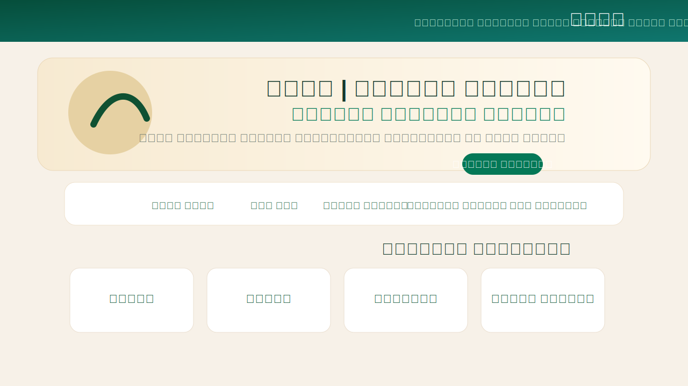
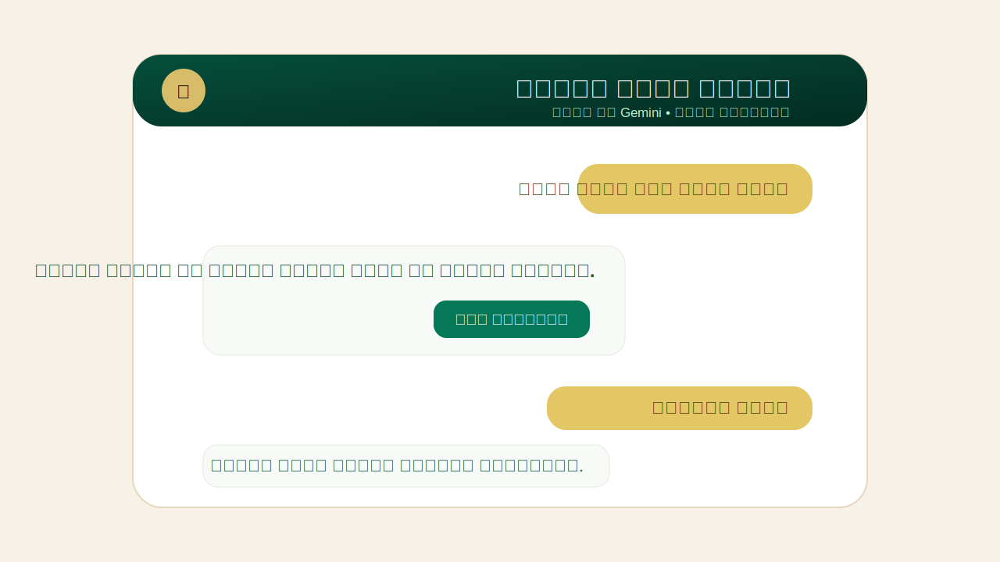
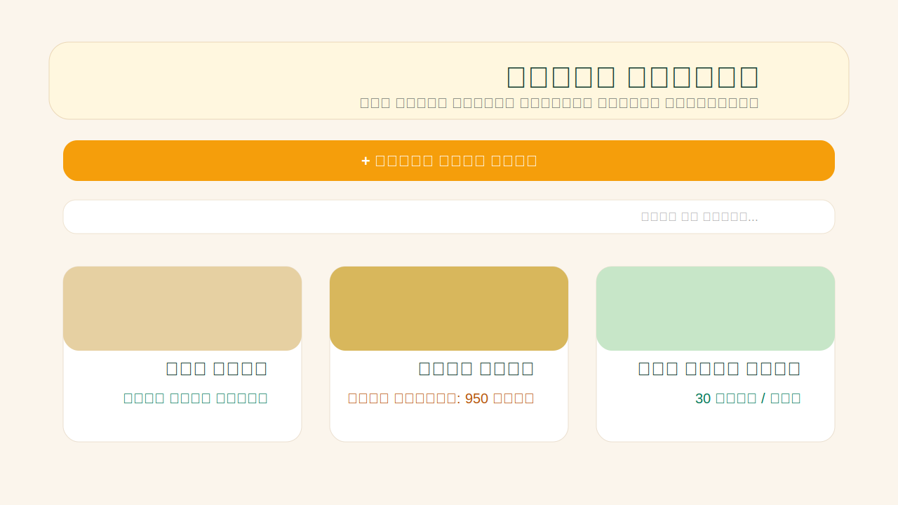
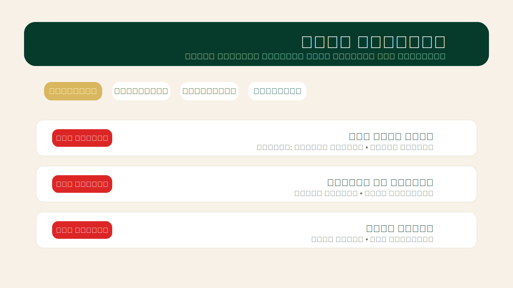

انسخ هذا كامل وضعه في README.md مرة واحدة:

<div align="center">


# 🌴 Waha | واحة

### Smart Rural Services Platform  
### منصة الخدمات الريفية الذكية


**Waha** is a smart rural services platform for Al Qua’a and rural communities in Al Ain, UAE.

**واحة** منصة ذكية لخدمات المجتمع الريفي في القوع والعين، تجمع الخدمات الأساسية في مكان واحد مع مساعد ذكي باللغة العربية.

</div>

---

## 🌐 Live Demo

https://arabic-rtl-app-ai-as-29nb.bolt.host/

---

## 📦 GitHub Repository

https://github.com/202510085/Waha-Smart-Rural-Services-Platform

---

## 📧 Contact

**Team Email:** `YOUR_TEAM_EMAIL@example.com`

---

# 📖 Overview | نبذة

## English

Waha is an AI-powered rural services platform designed to support Al Qua’a and rural communities in Al Ain, United Arab Emirates.

The platform connects residents with essential services through one unified digital experience, including local marketplace, auctions, community reports, events, announcements, transport requests, health services, agriculture support, emergency access, and an Arabic AI assistant.

Instead of relying on scattered communication channels, Waha provides one smart platform that helps residents access services faster and easier.

## العربية

واحة هي منصة ذكية للخدمات الريفية تم تطويرها لخدمة سكان القوع والمناطق الريفية في مدينة العين، الإمارات العربية المتحدة.

تهدف المنصة إلى جمع الخدمات الأساسية في مكان واحد، مثل السوق المحلي، المزادات، البلاغات المجتمعية، الفعاليات، الإعلانات، طلبات النقل، الخدمات الصحية، الخدمات الزراعية، الطوارئ، والمساعد الذكي باللغة العربية.

---

# 🎯 Problem | المشكلة

## English

Rural communities often face challenges in accessing services quickly and clearly. Residents may need to sell local products, report community issues, request transport, find health services, discover events, or get agriculture support, but these services are usually scattered across different platforms or informal channels.

## العربية

تواجه المجتمعات الريفية تحديات في الوصول السريع والواضح للخدمات. فقد يحتاج السكان إلى بيع منتجات محلية، رفع بلاغ، طلب نقل، الوصول إلى خدمة صحية، معرفة الفعاليات، أو الحصول على دعم زراعي، لكن هذه الخدمات تكون غالبًا متفرقة وغير منظمة في منصة واحدة.

---

# 💡 Solution | الحل

## English

Waha brings rural community services into one intelligent Arabic-first platform. It uses Supabase for real data and authentication, Gemini AI for smart Arabic interaction, and a responsive interface that works across desktop and mobile.

## العربية

توفر واحة منصة موحدة وسهلة الاستخدام تجمع خدمات المجتمع الريفي في مكان واحد. تعتمد المنصة على Supabase لإدارة البيانات والمستخدمين، وعلى Gemini AI لتقديم مساعد ذكي يفهم اللغة العربية ويفتح الأقسام والنماذج المناسبة تلقائيًا.

---

# ✨ Key Features | المميزات

## 🏠 Smart Homepage

- Arabic RTL interface
- Quick service shortcuts
- Real platform statistics
- Latest updates
- Dark mode
- Responsive layout

## 🛒 Local Marketplace

- Add and browse products
- Product images
- Search and filtering
- Categories
- Auctions
- Live bidding
- Price in AED
- Seller product management

## 📢 Announcements

- Publish local announcements
- Add category
- Add date and time
- Add location
- Support for images
- Browse latest announcements

## 📅 Events

- Publish community events
- Event registration
- Ticket code generation
- Event categories
- Search and filters
- Location support
- Registration tracking

## 🚨 Community Reports

- Submit community reports
- Lighting, roads, water, cleanliness, safety, and other report types
- Add optional image
- GPS/location support
- Status tracking
- Admin moderation

## 🚑 Health Services

- Health service listings
- Health consultation requests
- GPS support
- Contact information
- Working hours where available
- Directions support

## 🌴 Agriculture Services

- AI crop scan
- Image upload
- Camera or gallery support
- Agriculture advice requests
- Palm tree and crop support
- Date price display in AED

## 🚗 Smart Transport

- Ride requests
- Destination selection
- Transport assistance
- Useful for rural mobility needs

## 🆘 Emergency / SOS

- Quick emergency access
- Emergency numbers
- Location sharing support
- Easy access floating SOS button

## 🤖 Arabic AI Assistant

- Arabic and English understanding
- Voice input support
- Smart navigation
- Intent detection
- Form auto-fill
- Crop image analysis
- Supabase-based answers
- Safe fallback mode

---

# 🤖 Artificial Intelligence | الذكاء الاصطناعي

The project uses **Google Gemini AI** for smart assistance.

AI capabilities:

- Understand Arabic user requests
- Detect user intent
- Open the correct section
- Open the correct form
- Pre-fill form fields
- Answer from real Supabase data
- Analyze crop images
- Support Arabic voice input
- Avoid showing raw JSON or code to users

Example:

```text
أريد أبيع تمر خلاص فاخر

The assistant opens the local market form and pre-fills the product name and category.

Example:

الشارع مظلم

The assistant opens the community report form and pre-fills a lighting report.


---

🛠 Technologies Used | الأدوات والتقنيات المستخدمة

Frontend

React 18

TypeScript

Vite

Tailwind CSS

Lucide React Icons

Arabic RTL UI


Backend & Database

Supabase

Supabase PostgreSQL Database

Supabase Authentication

Supabase Storage

Supabase Row Level Security (RLS)


Artificial Intelligence

Google Gemini AI

Gemini Vision

AI Intent Detection

AI Crop Analysis

AI Assistant Fallback Logic


Location & Maps

Browser Geolocation API

Google Maps Directions Links


Deployment & Development

Bolt.new

GitHub

npm

Vite Build


---

🗄 Database Structure | قاعدة البيانات

The project uses Supabase PostgreSQL tables such as:

profiles

products

product_images

product_bids

announcements

events

event_registrations

community_reports

health_requests

agriculture_requests

ride_requests

emergency_requests


---

🔒 Security | الأمان

Security features:

Supabase Authentication

Row Level Security

Admin role

Protected admin dashboard

Environment variables

No service role key exposed in frontend

Users can manage only their own content

Admin can moderate platform content through RLS policies


---

👨‍💼 Admin Dashboard | لوحة المسؤول

Admin users can:

Delete any product

Delete announcements

Delete events

Delete community reports

Review platform content

Moderate user-generated data


Admin access is controlled through the role column in Supabase profiles.


---

📱 Screenshots | صور المشروع

Homepage

AI Assistant

Local Market

Admin Dashboard


---

🚀 Getting Started | التشغيل المحلي

Install dependencies:

npm install

Run development server:

npm run dev

Build for production:

npm run build


---

🔑 Environment Variables | متغيرات البيئة

Create a .env file:

VITE_SUPABASE_URL=
VITE_SUPABASE_ANON_KEY=
VITE_GEMINI_API_KEY=

Bolt secret:

GEMINI_API_KEY=

Do not commit real API keys to GitHub.


---

🧑‍💼 Admin Account Setup

Admin accounts must be promoted from Supabase SQL Editor only.

UPDATE public.profiles
SET role = 'admin'
WHERE id = (
  SELECT id
  FROM auth.users
  WHERE lower(email) = lower('admin@example.com')
);

Replace admin@example.com with the real admin email.


---

🧪 Main User Flows | سيناريوهات الاستخدام

Resident

1. Login


2. Browse services


3. Submit report


4. Register for events


5. Request transport


6. Ask AI assistant


Seller / Farmer

1. Add product


2. Upload product images


3. Create auction


4. Manage products


Organizer

1. Publish announcement


2. Create event


3. Track registrations


Admin

1. Login as admin


2. Open admin dashboard


3. Review content


4. Delete inappropriate or test data


---

🏆 Hackathon

Built for:

Tatweer Hackathon 2026

In partnership with:

Athar+

Challenge focus:

Connecting residents to services, opportunities, and events.


---

⚠️ Current Limitations

Some features depend on available Supabase data

AI crop scan provides initial guidance, not professional diagnosis

Gemini features require a valid API key

Phone verification is demo-level for hackathon purposes

Production use requires stronger monitoring and official integrations


---

🔮 Future Improvements

Real SMS OTP

Push notifications

Mobile app

Municipality integration

Government service APIs

Service provider dashboard

Advanced admin analytics

Real-time report tracking

Offline support

More advanced agriculture AI recommendations


---

👤 Developer | المطور

Mohammed Ali Almahboobi Alshehhi

United Arab Emirates University

Tatweer Hackathon 2026


---

<div align="center">🌴 Waha | واحة

Connecting Rural Communities Through Technology

ربط المجتمعات الريفية بالتقنية

Made with ❤️ for Tatweer Hackathon 2026

</div>
```
