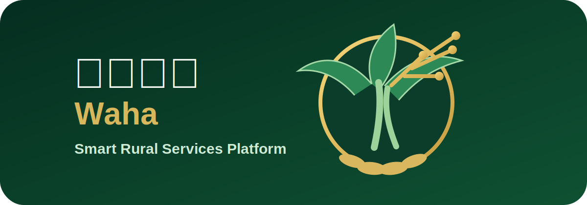

# Waha-Smart-Rural-Services-Platform

🌴 Waha | واحة

Smart Rural Services Platform

منصة الخدمات الريفية الذكية

"React" (https://img.shields.io/badge/React-18-61DAFB)
"TypeScript" (https://img.shields.io/badge/TypeScript-5-blue)
"Vite" (https://img.shields.io/badge/Vite-Frontend-purple)
"Tailwind CSS" (https://img.shields.io/badge/TailwindCSS-Styling-38BDF8)
"Supabase" (https://img.shields.io/badge/Supabase-Database-3ECF8E)
"Google Gemini" (https://img.shields.io/badge/Google-Gemini_AI-orange)
"Arabic RTL" (https://img.shields.io/badge/Arabic-RTL-success)
"Tatweer Hackathon" (https://img.shields.io/badge/Tatweer-Hackathon_2026-gold)

---

🌐 Live Demo

Website

https://arabic-rtl-app-ai-as-29nb.bolt.host/

---

📦 GitHub Repository

https://github.com/202510085/Waha-Smart-Rural-Services-Platform

---

📧 Contact

Team Email

"YOUR_TEAM_EMAIL@example.com"

---

📖 Overview | نبذة

🇬🇧 English

Waha is an AI-powered rural services platform designed for Al Qua’a and rural communities in Al Ain, UAE.

The platform provides one unified digital ecosystem where residents can access health services, agriculture support, transport, community reports, local marketplace, announcements, events, emergency services, and an intelligent Arabic AI assistant.

The goal is to simplify access to essential services while improving communication between residents and the community.

---

🇦🇪 العربية

واحة هي منصة ذكية للخدمات الريفية تم تطويرها لخدمة سكان القوع والمناطق الريفية في مدينة العين، الإمارات العربية المتحدة.

توفر المنصة جميع الخدمات في مكان واحد، مثل:

- السوق المحلي
- البلاغات المجتمعية
- الفعاليات
- الإعلانات
- النقل الذكي
- الخدمات الصحية
- الخدمات الزراعية
- الطوارئ
- مساعد ذكي باللغة العربية

---

🎯 Challenge

Many rural communities still depend on scattered communication channels to access important services.

Residents often struggle to:

- Find nearby services
- Sell local products
- Report problems
- Discover events
- Request transportation
- Access agriculture support

---

💡 Solution

Waha brings everything together into one smart platform powered by Artificial Intelligence, cloud services, and GPS.

Instead of using multiple disconnected systems, users interact with one intelligent platform.

---

✨ Main Features

🏠 Smart Homepage

- Arabic RTL Interface
- Quick Actions
- Real Statistics
- Latest Updates
- Dark Mode
- Responsive Design

---

🛒 Local Marketplace

- Publish products
- Product gallery
- Multiple images
- Auctions
- Live bidding
- Search
- Filters
- GPS location

---

📢 Community Announcements

- Publish announcements
- Categories
- Images
- Date & Time
- GPS location

---

📅 Community Events

- Publish events
- Event registration
- Event tickets
- Categories
- Search
- Location support

---

🚨 Community Reports

- Lighting
- Roads
- Water
- Safety
- Cleanliness
- Image upload
- GPS
- Report status

---

🚑 Health Services

- Nearby health centers
- Consultation requests
- GPS support
- Contact information
- Working hours

---

🌴 Agriculture Services

- Crop Scan using AI
- Image upload
- Agriculture consultation
- Palm tree support

---

🚗 Smart Transport

- Ride requests
- Destination selection
- GPS
- Transport assistance

---

🆘 Emergency (SOS)

- Emergency numbers
- SOS
- Quick access
- Location sharing

---

🤖 Artificial Intelligence

The project integrates Google Gemini AI.

Features include:

- Arabic understanding
- English understanding
- Voice input
- Smart navigation
- Intent detection
- Form auto-fill
- Crop image analysis
- Context-aware conversation
- Fallback assistant
- Real Supabase data answers

Example:

User:

«أريد أبيع تمر خلاص فاخر»

Assistant:

✅ Opens Local Market

✅ Opens Product Form

✅ Prefills Product Name

✅ Prefills Category

---

🛠 Technologies Used

Frontend

- React 18
- TypeScript
- Vite
- Tailwind CSS
- Lucide React Icons

Backend

- Supabase Authentication
- Supabase PostgreSQL Database
- Supabase Storage
- Supabase Row Level Security (RLS)

Artificial Intelligence

- Google Gemini AI
- Gemini Vision
- AI Intent Detection
- AI Crop Analysis

Maps & Location

- Browser Geolocation API
- Google Maps Directions

Deployment

- Bolt.new
- GitHub

---

🗄 Database

The application uses Supabase PostgreSQL.

Main Tables

- profiles
- products
- product_images
- product_bids
- announcements
- events
- event_registrations
- community_reports
- health_requests
- agriculture_requests
- ride_requests

---

🔒 Security

The project implements:

- Row Level Security (RLS)
- Secure Authentication
- Admin Role
- Protected Routes
- Environment Variables
- Secure Storage
- Optional Image Upload
- Database Policies

Normal users can only manage their own content.

Administrators can moderate platform content securely.

---

👨‍💼 Admin Dashboard

Admin Features

- Delete any product
- Delete reports
- Delete announcements
- Delete events
- Moderate content
- Review registrations

---

📱 User Journey

Resident

- Login
- Browse services
- Report issues
- Register for events
- Request transport
- Use AI assistant

Seller

- Add products
- Upload images
- Create auctions
- Manage products

Organizer

- Create events
- Publish announcements
- Track registrations

Administrator

- Review platform
- Moderate content
- Delete inappropriate content

---

⚙ Environment Variables

VITE_SUPABASE_URL=

VITE_SUPABASE_ANON_KEY=

VITE_GEMINI_API_KEY=

Bolt Secret

GEMINI_API_KEY=

---

🚀 Installation

Install

npm install

Development

npm run dev

Production Build

npm run build

---

📸 Screenshots

Homepage

(Add Screenshot)

---

Marketplace

(Add Screenshot)

---

AI Assistant

(Add Screenshot)

---

Admin Dashboard

(Add Screenshot)

---

🏆 Hackathon

Developed for

Tatweer Hackathon 2026

Partner

Athar+

---

🚀 Future Improvements

- Push Notifications
- Municipality APIs
- Government Integration
- Offline Mode
- SMS OTP
- Advanced Analytics
- AI Recommendations
- Mobile Application

---

👤 Developer

Mohammed Ali Almahboobi Alshehhi

United Arab Emirates University

---

🌴 Waha

Connecting Rural Communities Through Technology

Made with ❤️ for Tatweer Hackathon 2026

